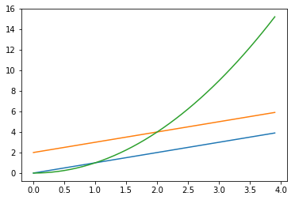
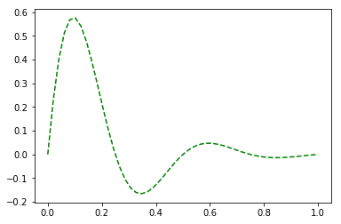
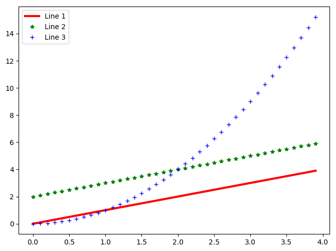
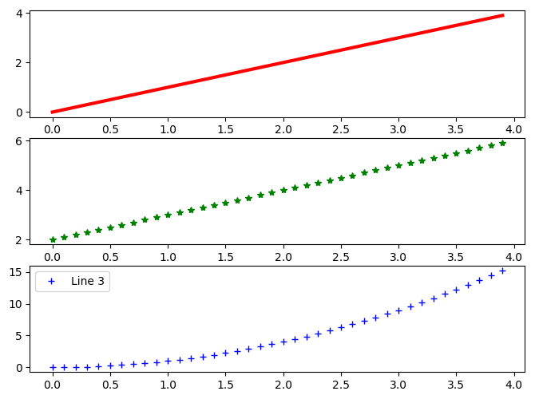
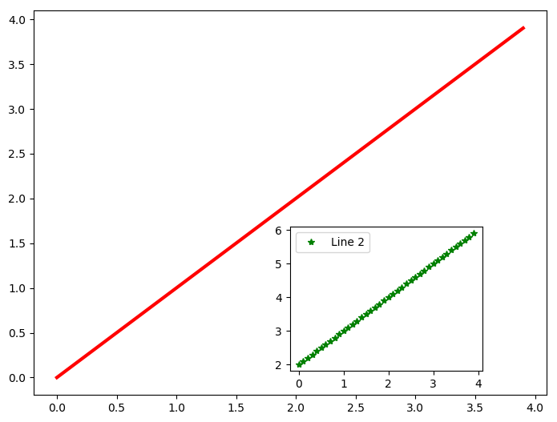

#### 数据整理

日期转化

获取的某组信息中，日期的表示方法为格里高利历法(Gregorian calendar)，要转化为通常的日期表示方法，可以使用datetime.date.fromordinal()方法：

```
date.fromordinal(736082)
Out[19]:
datetime.date(2016, 4, 28)
```

对于Series，可以使用apply整体转化：

```
quotesdf['date']=quotesdf['date'].apply(int).apply(date.fromordinal)
```

<!---more--->

pandas生成日期序列

生成从起始日期始的某个周期内所有日期的序列：

```

import pandas as pd
dates=pd.date_range('20170427',periods=10)
dates
import pandas as pd
dates=pd.date_range('20170427',periods=10)
dates
Out[16]:
DatetimeIndex(['2017-04-27', '2017-04-28', '2017-04-29', '2017-04-30',
               '2017-05-01', '2017-05-02', '2017-05-03', '2017-05-04',
               '2017-05-05', '2017-05-06'],
              dtype='datetime64[ns]', freq='D')
```
#### 数据选择

选择行：

```
quotesdf.index=quotesdf['date'].apply(str)
quotesdf=quotesdf.drop(['date'],axis=1)
quotesdf.loc['2017-01-06'] #选择一行
quotesdf['2017-01-06':'2017-01-28'] #选择多行
```

选择列：

```
quotesdf['open']
quotesdf.open  #open为column_name
```

选择行和列：(loc参数，前面选择列，后面选择行）

```
quotesdf.loc['2017-01-06':'2017-01-28',['high','lower']]
quotesdf.iloc[1:5,1:3] #通过行列位置来选择
```

选择单个值：

```
quotesdf.at['2017-01-06','high']
```

#### 数据统计与处理

计算某列相邻两数值之间差值：

```
np.diff(quotesdf['close'])
np.sign(np.diff(quotesdf['close'])) #仅显示为正值或负值
```

排序：（根据某一列的值，ascending=1表示升序，ascending=0表示降序）

```
quotesdf.sort(columns='open',ascending=1)
```

#### Merge

##### Append

```
p=quotesdf[:2]
```

|            | open      | close     | high      | low       | volume     | month |
| ---------- | --------- | --------- | --------- | --------- | ---------- | ----- |
| date       |           |           |           |           |            |       |
| 2017-01-03 | 62.411631 | 62.202897 | 62.461328 | 61.755608 | 20694100.0 | 01    |
| 2017-01-04 | 62.103497 | 61.924581 | 62.371870 | 61.745666 | 21340000.0 | 01    |

```
q=quotesdf['2017-02-03':'2017-02-07']
```

|            | open      | close     | high      | low       | volume     | month |
| ---------- | --------- | --------- | --------- | --------- | ---------- | ----- |
| date       |           |           |           |           |            |       |
| 2017-02-03 | 63.117352 | 63.296267 | 63.316147 | 62.689943 | 30301800.0 | 02    |
| 2017-02-06 | 63.117352 | 63.256507 | 63.266450 | 62.759520 | 19796400.0 | 02    |
| 2017-02-07 | 63.355907 | 63.047773 | 63.395663 | 62.848978 | 20277200.0 | 02    |

```
p.append(q)
```

|            | open      | close     | high      | low       | volume     | month |
| ---------- | --------- | --------- | --------- | --------- | ---------- | ----- |
| date       |           |           |           |           |            |       |
| 2017-01-03 | 62.411631 | 62.202897 | 62.461328 | 61.755608 | 20694100.0 | 01    |
| 2017-01-04 | 62.103497 | 61.924581 | 62.371870 | 61.745666 | 21340000.0 | 01    |
| 2017-02-03 | 63.117352 | 63.296267 | 63.316147 | 62.689943 | 30301800.0 | 02    |
| 2017-02-06 | 63.117352 | 63.256507 | 63.266450 | 62.759520 | 19796400.0 | 02    |
| 2017-02-07 | 63.355907 | 63.047773 | 63.395663 | 62.848978 | 20277200.0 | 02    |

##### concat

连接前三和后三个数据

```
pieces=[quotesdf[:3],quotesdf[-3:]]
pd.concat(pieces)
```

|            | open      | close     | high      | low       | volume     | month |
| ---------- | --------- | --------- | --------- | --------- | ---------- | ----- |
| date       |           |           |           |           |            |       |
| 2017-01-03 | 62.411631 | 62.202897 | 62.461328 | 61.755608 | 20694100.0 | 01    |
| 2017-01-04 | 62.103497 | 61.924581 | 62.371870 | 61.745666 | 21340000.0 | 01    |
| 2017-01-05 | 61.815244 | 61.924581 | 62.282413 | 61.656208 | 24876000.0 | 01    |
| 2017-03-29 | 65.120003 | 65.470001 | 65.500000 | 64.949997 | 13512400.0 | 03    |
| 2017-03-30 | 65.419998 | 65.709999 | 65.980003 | 65.360001 | 15100400.0 | 03    |
| 2017-03-31 | 65.650002 | 65.860001 | 66.190002 | 65.449997 | 21001100.0 | 03    |

逻辑结构不同的也可以连接：

```
quotes_without_month=quotesdf.drop('month',axis=1)
pieces=[quotesdf[:3],quotes_without_month[-3:]]
pd.concat(pieces)
```

|            | close     | high      | low       | month | open      | volume     |
| ---------- | --------- | --------- | --------- | ----- | --------- | ---------- |
| date       |           |           |           |       |           |            |
| 2017-01-03 | 62.202897 | 62.461328 | 61.755608 | 01    | 62.411631 | 20694100.0 |
| 2017-01-04 | 61.924581 | 62.371870 | 61.745666 | 01    | 62.103497 | 21340000.0 |
| 2017-01-05 | 61.924581 | 62.282413 | 61.656208 | 01    | 61.815244 | 24876000.0 |
| 2017-03-29 | 65.470001 | 65.500000 | 64.949997 | NaN   | 65.120003 | 13512400.0 |
| 2017-03-30 | 65.709999 | 65.980003 | 65.360001 | NaN   | 65.419998 | 15100400.0 |
| 2017-03-31 | 65.860001 | 66.190002 | 65.449997 | NaN   | 65.650002 | 21001100.0 |

#### 聚类分析

k-均值算法——简洁、快速、使用广泛

流程：

- 任意选择k个对象作为初始聚类中心
- 对每个点计算聚类中心点（一般采用均方差作为测度函数来计算距离）
- 计算每个新聚类的聚类中心，直到收敛（即确定的中心点不再变化）

要求：保证各聚类本身尽可能紧凑、各聚类之间尽可能分开

scikit-learn机器学习包、scipy.clustre等聚类算法包中都会有k-均值算法

案例：

​	已知有一学霸的四科成绩为：100,95,100,92，同时知道另外五名同学的成绩，通过聚类分析，找出另外五名同学中的学霸和非学霸。

```
from pylab import *
from scipy.cluster.vq import * #聚类分析包
list1=[88.0,74,96,85]  #将现有六组成绩放入6个list，注意kmeans()函数只接受浮点数
list2=[92,99,95,94]
list3=[91,87,99,95]
list4=[78,99,97,81]
list5=[88,78,98,84]
list6=[100,95,100,92]
data=vstack((list1,list2,list3,list4,list5,list6))  #堆积数据
centroids,_=kmeans(data,2)  
#利用kmeans计算，第一个参数为需聚类的数据，第二个数据为聚类数目。返回含两个元素的元组，第一个为聚类中心。
result,_=vq(data,centroids) #用已有数据和聚类中心进行聚类
print result
```

Out：

```
[1 0 0 0 1 0]
```

用0,1表示两个聚类。可以看出第1,5名同学为一类，第2,3,4,6名同学为一类。

#### Matplotlab绘图基础

- 主要用于二维绘图
- 绘图API——pyplot模块
- 集成库——pylab模块（包含NumPy和pyplot中的常用函数）

折线图

```
import matplotlib.pyplot as plt
t=np.arange(0.,4.,0.1)
plt.plot(t,t,t,t+2,t,t**2) #3组横纵坐标值
plt.show()
```



图像属性控制：

线条色彩和样式

通过第三个参数来指定：

```
import pylab as pl
pl.plot(x, y,'g--')  #表示线条为绿色虚线
```



```
pl.plot(x, y,'rD') #红色钻石形状散点
```

其他样式：


其他属性：

```
import matplotlib.pylab as pl
pl.figure(figsize=(8,6),dpi=100)  #指定图的大小和精度
t=np.arange(0.,4.,0.1)
pl.plot(t,t,color='red',linestyle='-',linewidth=3,label='Line 1')
#指定颜色，样式，线宽，图例
pl.plot(t,t+2,color='green',linestyle='',marker='*',linewidth=3,label='Line 2')
pl.plot(t,t**2,color='blue',linestyle='',marker='+',linewidth=3,label='Line 3')
pl.legend(loc='upper left')  #图例位置
pl.show()
```



控制子图区域：

subplot子图：三个参数表示子图分几行几列，当前在第几区域绘图（小于10逗号可省略）

```
subplot(3,1,1)
pl.plot(t,t,color='red',linestyle='-',linewidth=3,label='Line 1')
subplot(312)
pl.plot(t,t+2,color='green',linestyle='',marker='*',linewidth=3,label='Line 2')
subplot(313)
pl.plot(t,t**2,color='blue',linestyle='',marker='+',linewidth=3,label='Line 3')
```



axes子图：

axes([left,bottom,width,height]) 参数分别表示离左边界，底边界距离，图像高和宽（范围0-1）

```
pl.axes([0.1,0.1,0.8,0.8])
pl.plot(t,t,color='red',linestyle='-',linewidth=3,label='Line 1')
pl.axes([0.5,0.15,0.3,0.3])
pl.plot(t,t+2,color='green',linestyle='',marker='*',linewidth=3,label='Line 2')
```



#### pandas作图

Pandas可以直接对Series和DataFrame绘图

用Pandas做图之后，还可以使用plt中的函数来对参数做修改。

```
import numpy as np
import matplotlib.pyplot as plt
import pandas as pd
x = np.linspace(0, 1)
y = np.sin(4 * np.pi * x) * np.exp(-5 * x)
t = pd.DataFrame(y,index =x)
t.plot()
plt.show()
```

指定参数：

```
df.plot(kind='bar')  #绘制柱形图
df.plot(kind='barh')  #绘制横向柱形图
df.plot(kind='bar',stacked=True)  #绘制累积柱形图
df.plot(kind='scatter') #绘制散点图
df.plot(x='',y='',color='')  #指定横纵坐标label和颜色
df.plot(kind='kde')  #绘制概率分布图
```